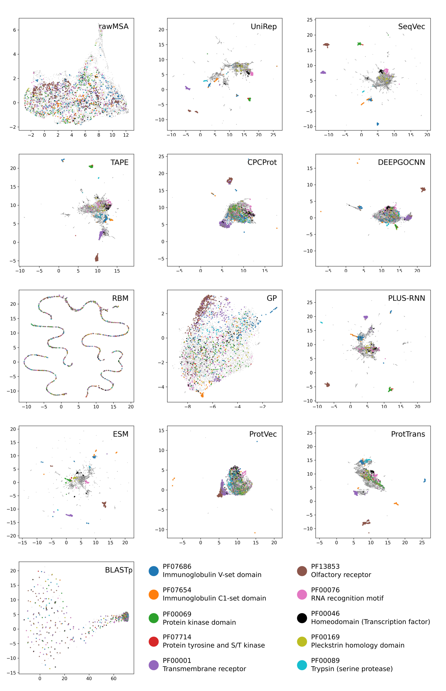

# Transfer learning in proteomics: comparison of protein sequence embeddings

This repository contains the data and code used in the review of protein
sequence embeddings entitled *"Transfer learning in proteomics: comparison of
novel learned representations for protein sequences,"* by E. Fenoy, A. Edera
and G. Stegmayer (under review). Research Institute for Signals, Systems and
Computational Intelligence, [sinc(i)](https://sinc.unl.edu.ar).

In the figure above, points depict 2D non-linear projections calculated from
the 12 protein sequence embeddings studied. Orange points highlight protein
sequences having the *Immunoglobulin C1-set domain*
([PF07654](http://pfam.xfam.org/family/PF07654)).

The figures above show the performance of the 12 embeddings used for
predicting the GO terms annotating protein sequences. Performance is measured
with the F1 score and predictions are grouped according to the three
sub-ontologies of the GO terms: Biological Process (BP), Cellular Component
(CC) and Molecular Function (MF).

## Introduction

Recently, representation learning techniques are being proposed for encoding
different types of protein information (sequence, domains, interactions, etc.)
as low-dimensional vectors. In this review, we performed a detailed
experimental comparison of several protein sequence embeddings on several
bioinformatics tasks:

* determining similarities between proteins in the embeddings projected space.

* inferring protein domains.

* predicting GO ontology-based protein functions.

## Notebook

This
[notebook](https://colab.research.google.com/github/sinc-lab/Comparison-of-Protein-learning/blob/master/notebooks/01_projections_with_PFAM_domains.ipynb)
reproduces the visual comparative analysis of 12 embeddings in the evaluation
of the capability of protein sequence embeddings for capturing protein domain
information.

## Protein sequence embeddings

The review used 9,479 [human protein sequences](seqs/Proteins_HS_700.fas) to
build
[embeddings](https://drive.google.com/drive/folders/10lBH8WLrSqS2Mjz6m-QpTBeOmWZbOKHF)
with 12 embedding methods.

**Note:** Click the method name below to download the embeddings used in this
  review.

<table>
<tr>
<th>
Embedding
</th>
<th>
Dimensionality
</th>
<th>
Reference
</th>
</tr>

<tr>
<td>

[CPCProt](https://drive.google.com/file/d/16Fh16n6cMiDgkb3KAJrGnfK9xqFvyt4L)

</td>
<td>
512
</td>
<td>

[Lu et al., 2020](https://doi.org/10.1101/2020.09.04.283929)

</td>
</tr>

<tr>
<td>

[DeepGOCNN](https://drive.google.com/file/d/1lLh4ppy90wJ6qgMTxsbXuLJdr6jaSs47)

</td>
<td>
8,192
</td>
<td>

[Kulmanov & Hoehndorf, 2019](https://doi.org/10.1093/bioinformatics/btaa763)

</td>
</tr>

<tr>
<td>

[ESM](https://drive.google.com/file/d/1JnvtaWP1Vc9tq4_PJVVO4zWTlCaac_3u)

</td>
<td>
1,280
</td>
<td>

[Rives et al., 2021](https://doi.org/10.1073/pnas.2016239118)

</td>
</tr>

<tr>
<td>

[GP](https://drive.google.com/file/d/1k3OJHnUBaB95cWOA7n4b5mmf-ebWIR7E)

</td>
<td>
64
</td>
<td>

[Yang et al., 2018](https://doi.org/10.1093/bioinformatics/bty455)

</td>
</tr>

<tr>
<td>

[Plus-RNN](https://drive.google.com/file/d/1bqgsa7LZHUM6JAp7RYfLch8qNrZIpc9N)

</td>
<td>
1,024
</td>
<td>

[Min et al., 2021](http://doi.org/10.1109/ACCESS.2021.3110269)

</td>
</tr>

<tr>
<td>

[ProtTrans](https://drive.google.com/file/d/1RgU9ODaKLp7X8OkYufomB8EQqsdFhshA)

</td>
<td>
1,024
</td>
<td>

[Elnaggar et al., 2021](https://doi.org/10.1109/tpami.2021.3095381)

</td>
</tr>

<tr>
<td>

[ProtVec](https://drive.google.com/file/d/1t9slf5ER980D_XqwZcL1pd1E7J3nwzil)

</td>
<td>
300
</td>
<td>

[Asgari & Mofrad, 2015](https://doi.org/10.1371/journal.pone.0141287)

</td>
</tr>

<tr>
<td>

[rawMSA](https://drive.google.com/file/d/1Ql6ItNw_rCVWLNQYcWOZga-NWKT6ARF8)

</td>
<td>
50
</td>
<td>

[Mirabello & Wallner, 2019](https://doi.org/10.1371/journal.pone.0220182)

</td>
</tr>

<tr>
<td>

[RBM](https://drive.google.com/file/d/1xbLLzUYm_47XKp0Y1x5CqPqMcCsh_4S9)

</td>
<td>
100
</td>
<td>

[Tubiana et al., 2019](https://doi.org/10.7554/eLife.39397.001)

</td>
</tr>

<tr>
<td>

[SeqVec](https://drive.google.com/file/d/1MkZ02mwW-bQUsF8lCiSAPAOU99eswaso)

</td>
<td>
1,024
</td>
<td>

[Heinzinger et al., 2019](https://doi.org/10.1186/s12859-019-3220-8)

</td>
</tr>

<tr>
<td>

[TAPE](https://drive.google.com/file/d/1BVZHBLfwZaocis_TCuojFOSoaU68NbPP)

</td>
<td>
768
</td>
<td>

[Rao et al., 2019](https://pubmed.ncbi.nlm.nih.gov/33390682/)

</td>
</tr>

<tr>
<td>

[UniRep](https://drive.google.com/file/d/1D5cxlq5rnbfMjcC-V9BjTJlpKhHdOX73)

</td>
<td>
1,900
</td>
<td>

[Alley et al., 2019](https://doi.org/10.1038/s41592-019-0598-1)

</td>
</tr>
</table>
